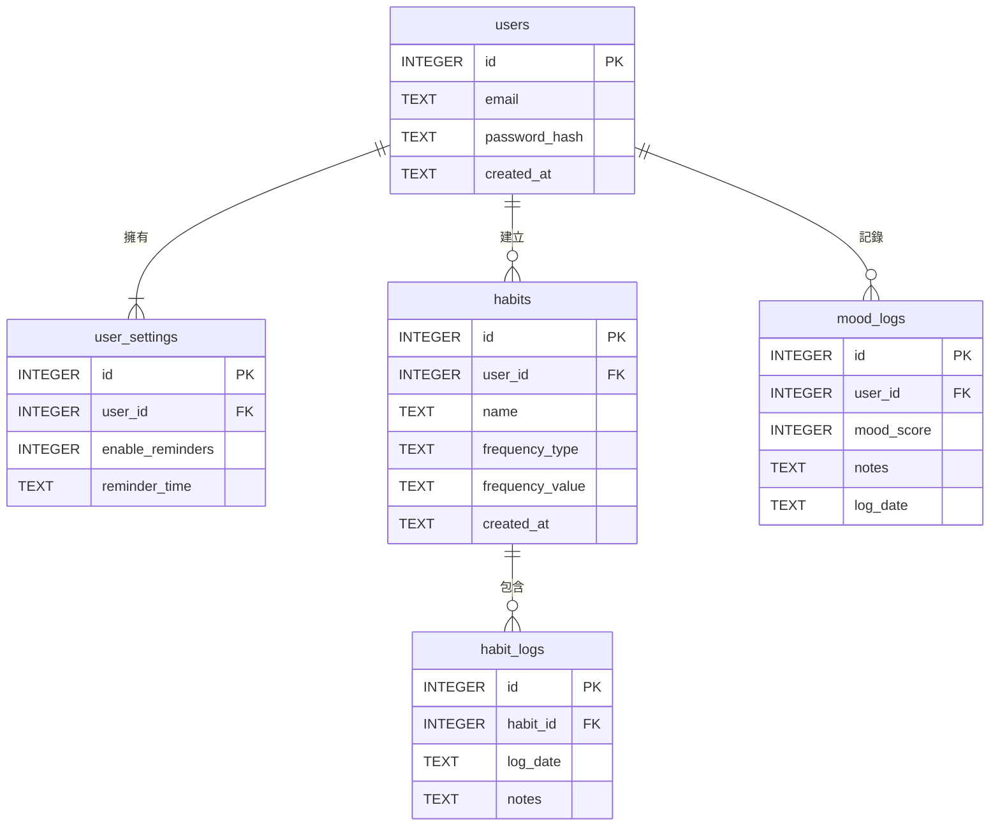

# 資料庫綱要設計 

## 核心資料表詳解 (Core Table Details)

### 1\. 使用者 (users)

**用途說明：**
這張表是所有資料的根基，用來存放每一位註冊使用者的帳號資訊。沒有它，我們就無法區分哪個習慣是屬於哪個使用者的。

**欄位詳解：**

  * **id:** 每一位使用者獨一無二的數字編號，就像是他們的身分證號碼。
  * **email:** 使用者用來登入的電子信箱，我們設定它是唯一的，不允許重複註冊。
  * **password\_hash:** 基於安全性考量，我們絕不直接儲存使用者的明碼密碼。這個欄位儲存的是經過特殊加密演算法處理後的密碼字串。
  * **created\_at:** 記錄使用者註冊的確切時間，這對於未來分析使用者增長趨勢或排查問題非常有幫助。

**綱要表格:**
| 欄位名稱 (Column) | 資料型態 (Type) | 限制/說明 (Constraint/Note) |
| :--- | :--- | :--- |
| id | INTEGER | 主鍵 (PK), 自動遞增 |
| email | TEXT | UNIQUE, NOT NULL (使用者登入帳號) |
| password\_hash | TEXT | NOT NULL (儲存加密後的密碼) |
| created\_at | TEXT | NOT NULL (帳號建立時間, 格式: 'YYYY-MM-DD HH:MM:SS') |

### 2\. 習慣 (habits)

**用途說明：**
這張表用來儲存使用者想要養成的每一個習慣。此版本強化了頻率設定，以支援如「每週一、三、五運動」等更複雜的規則。

**欄位詳解：**

  * **id:** 每個習慣的唯一數字編號。
  * **user\_id:** 外鍵，將這個習慣「綁」在 users 表的某個使用者身上。
  * **name:** 習慣的名稱，這是使用者最主要的識別依據。
  * **frequency\_type:** 用於定義習慣的頻率類型，例如 'daily' (每日) 或 'weekly' (每週)。
  * **frequency\_value:** 根據 frequency\_type 儲存對應的值。例如，如果類型是 'weekly'，這裡可以儲存 '1,3,5' 來代表週一、週三、週五。
  * **created\_at:** 記錄這個習慣被建立的時間。

**綱要表格:**
| 欄位名稱 (Column) | 資料型態 (Type) | 限制/說明 (Constraint/Note) |
| :--- | :--- | :--- |
| id | INTEGER | 主鍵 (PK), 自動遞增 |
| user\_id | INTEGER | 外鍵 (FK) -\> users(id), NOT NULL |
| name | TEXT | NOT NULL (習慣的名稱) |
| frequency\_type | TEXT | NOT NULL (例如: 'daily', 'weekly') |
| frequency\_value| TEXT | NULL (例如: '1,3,5' 代表週一三五) |
| created\_at | TEXT | NOT NULL (習慣建立時間, 格式: 'YYYY-MM-DD HH:MM:SS') |

### 3\. 習慣打卡紀錄 (habit\_logs)

**用途說明：**
這張表是整個習慣追蹤功能的核心。它記錄「哪一天，哪個習慣被完成了」這個行為。使用者每點擊一次完成，就會在這裡新增一筆紀錄。

**欄位詳解：**

  * **id:** 每一次打卡行為的唯一編號。
  * **habit\_id:** 外鍵，將這筆打卡紀錄連結到 habits 表中的某一個特定習慣。
  * **log\_date:** 記錄打卡的日期，這是計算連續天數和生成日曆熱圖的關鍵。
  * **notes:** 選填欄位，讓使用者可以為當天的完成情況留下筆記。

**綱要表格:**
| 欄位名稱 (Column) | 資料型態 (Type) | 限制/說明 (Constraint/Note) |
| :--- | :--- | :--- |
| id | INTEGER | 主鍵 (PK), 自動遞增 |
| habit\_id | INTEGER | 外鍵 (FK) -\> habits(id), NOT NULL |
| log\_date | TEXT | NOT NULL (打卡的日期, 格式: 'YYYY-MM-DD') |
| notes | TEXT | NULL (對此次打卡的選填備註) |

### 4\. 心情紀錄 (mood\_logs)

**用途說明：**
這張表獨立於習慣，專門用來記錄使用者每天的心情狀態，以滿足專案的另一大核心功能。

**欄位詳解：**

  * **id:** 每一次心情紀錄的唯一編號。
  * **user\_id:** 外鍵，將這筆心情紀錄連結到 users 表。
  * **mood\_score:** 用一個數字來量化心情（例如 1 代表很不開心，5 代表非常開心）。
  * **notes:** 選填的文字欄位，讓使用者可以寫下心情日記。
  * **log\_date:** 記錄心情的日期。

**綱要表格:**
| 欄位名稱 (Column) | 資料型態 (Type) | 限制/說明 (Constraint/Note) |
| :--- | :--- | :--- |
| id | INTEGER | 主鍵 (PK), 自動遞增 |
| user\_id | INTEGER | 外鍵 (FK) -\> users(id), NOT NULL |
| mood\_score | INTEGER | NOT NULL (心情分數，例如 1-5 分) |
| notes | TEXT | NULL (對今日心情的選填文字描述) |
| log\_date | TEXT | NOT NULL (紀錄的日期, 格式: 'YYYY-MM-DD') |

### 5\. 使用者設定 (user\_settings) - (新增)

**用途說明：**
這是一張新增的資料表，專門用來存放每位使用者的個人化設定，例如是否開啟每日提醒、提醒的時間等。將設定與使用者主表分開，有助於保持主表的簡潔，也方便未來擴充更多設定選項。

**欄位詳解：**

  * **id:** 設定項的唯一編號。
  * **user\_id:** 外鍵，將這份設定連結到 users 表，且設定為 UNIQUE 以確保一位使用者只有一份設定。
  * **enable\_reminders:** 一個布林值 (用 0 或 1 表示)，記錄使用者是否開啟了每日提醒功能。
  * **reminder\_time:** 儲存使用者設定的每日提醒時間 (例如 '21:00')。

**綱要表格:**
| 欄位名稱 (Column) | 資料型態 (Type) | 限制/說明 (Constraint/Note) |
| :--- | :--- | :--- |
| id | INTEGER | 主鍵 (PK), 自動遞增 |
| user\_id | INTEGER | 外鍵 (FK) -\> users(id), UNIQUE, NOT NULL |
| enable\_reminders | INTEGER | NOT NULL, DEFAULT 1 (1=開啟, 0=關閉) |
| reminder\_time | TEXT | NOT NULL, DEFAULT '21:00' (提醒時間, 格式: 'HH:MM') |

-----

## 資料表關聯視覺化圖 (ERD)

下方的實體關係圖 (Entity-Relationship Diagram) 已更新，包含了新增的 user\_settings 資料表。

-----

## 關聯關係文字說明

  * **users 與 user\_settings (一對一):**
      * 關係：每一位 `user` 都只會有一份 `user_settings`。我們透過將 `user_settings.user_id` 設為唯一鍵 (UNIQUE) 來強制實現此關係。
  * **users 與 habits (一對多):**
      * 關係：一位 `user` 可以建立多個 `habits`，但每個 `habit` 只屬於一位 `user`。
  * **habits 與 habit\_logs (一對多):**
      * 關係：一個 `habit` 可以有多筆 `habit_logs`，但每筆 `habit_log` 只對應一個 `habit`。
  * **users 與 mood\_logs (一對多):**
      * 關係：一位 `user` 可以有多筆 `mood_logs`，但每筆 `mood_log` 只屬於一位 `user`。
