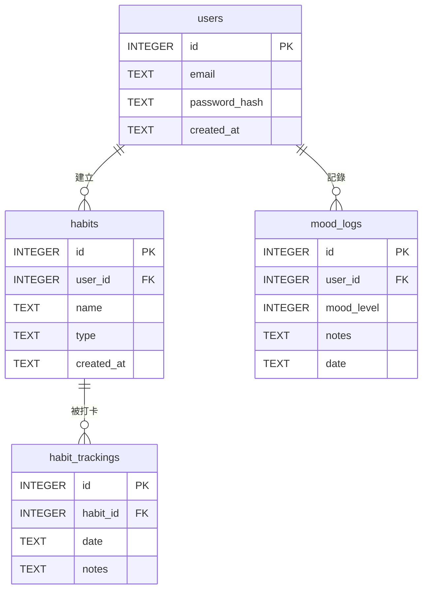

# 資料庫綱要設計：習慣養成與心情日誌

**版本：1.0**

**作者：Gemini (資料庫管理員)**

---

本文檔根據專案章程、使用者故事與軟體架構，為「習慣養成與心情日誌」應用程式設計關聯式資料庫綱要。此綱要專為 **SQLite** 設計，旨在實現資料的完整性、高效能與未來的可擴展性。

## 資料表規劃

### 1. `users` 資料表

*   **用途說明**：儲存應用程式的所有使用者帳號資訊。這是所有其他個人化資料的根源。
*   **欄位詳解**：

| 欄位名稱        | 資料型態  | 限制/索引             | 說明                         |
| :-------------- | :-------- | :-------------------- | :--------------------------- |
| `id`            | `INTEGER` | **PK**, AUTOINCREMENT | 唯一的使用者識別碼           |
| `email`         | `TEXT`    | UNIQUE, NOT NULL      | 使用者的電子郵件，用於登入   |
| `password_hash` | `TEXT`    | NOT NULL              | 儲存經雜湊處理的密碼         |
| `created_at`    | `TEXT`    | NOT NULL              | 帳號建立時間 (ISO 8601 格式) |

### 2. `habits` 資料表

*   **用途說明**：儲存由使用者定義的、他們想要追蹤的習慣。
*   **欄位詳解**：

| 欄位名稱     | 資料型態  | 限制/索引             | 說明                                    |
| :----------- | :-------- | :-------------------- | :-------------------------------------- |
| `id`         | `INTEGER` | **PK**, AUTOINCREMENT | 唯一的習慣識別碼                        |
| `user_id`    | `INTEGER` | **FK** -> `users.id`  | 關聯到建立此習慣的使用者                |
| `name`       | `TEXT`    | NOT NULL              | 習慣的名稱，例如「晨間運動」            |
| `type`       | `TEXT`    | NOT NULL              | 習慣類型，例如 'positive' 或 'negative' |
| `created_at` | `TEXT`    | NOT NULL              | 習慣建立時間 (ISO 8601 格式)            |

### 3. `habit_trackings` 資料表

*   **用途說明**：記錄使用者每一次完成習慣打卡的行為。這是最頻繁寫入的資料表之一。
*   **欄位詳解**：

| 欄位名稱   | 資料型態  | 限制/索引             | 說明                          |
| :--------- | :-------- | :-------------------- | :---------------------------- |
| `id`       | `INTEGER` | **PK**, AUTOINCREMENT | 唯一的打卡紀錄識別碼          |
| `habit_id` | `INTEGER` | **FK** -> `habits.id` | 關聯到被打卡的習慣            |
| `date`     | `TEXT`    | NOT NULL              | 打卡的日期 (YYYY-MM-DD 格式)  |
| `notes`    | `TEXT`    | NULL                  | (可選) 使用者對此次打卡的筆記 |

*註：應在 `(habit_id, date)` 上建立唯一性約束，防止同一天對同一個習慣重複打卡。*

### 4. `mood_logs` 資料表

*   **用途說明**：記錄使用者每日的心情狀態。
*   **欄位詳解**：

| 欄位名稱     | 資料型態  | 限制/索引             | 說明                          |
| :----------- | :-------- | :-------------------- | :---------------------------- |
| `id`         | `INTEGER` | **PK**, AUTOINCREMENT | 唯一的心情紀錄識別碼          |
| `user_id`    | `INTEGER` | **FK** -> `users.id`  | 關聯到記錄心情的使用者        |
| `mood_level` | `INTEGER` | NOT NULL              | 心情等級 (例如 1-5 的整數)    |
| `notes`      | `TEXT`    | NULL                  | (可選) 使用者對當天心情的筆記 |
| `date`       | `TEXT`    | NOT NULL              | 記錄的日期 (YYYY-MM-DD 格式)  |

*註：應在 `(user_id, date)` 上建立唯一性约束，確保每個使用者每天只能有一筆心情紀錄。*

---

## 關聯說明

*   **`users` 和 `habits`**：一對多 (One-to-Many)。一個使用者可以建立多個習慣，但每個習慣只屬於一個使用者。
*   **`users` 和 `mood_logs`**：一對多 (One-to-Many)。一個使用者可以有多天的情緒記錄，但每筆記錄只屬於一個使用者。
*   **`habits` 和 `habit_trackings`**：一對多 (One-to-Many)。一個習慣可以有多筆打卡記錄，但每筆打卡記錄只對應一個特定的習慣。

---

## 視覺化實體關係圖 (ERD)

