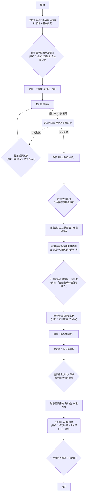

### 1. 初次設定與啟動

**使用者故事：**
身為一位想開始建立好習慣的新使用者，我想要能快速註冊帳號並設定我的第一個習慣，以便我能立即無礙地開始我的自我成長之旅。

**驗收標準 (Acceptance Criteria):**
* 使用者可以在 60 秒內，從進入網站到成功建立第一個習慣。
* 註冊流程僅需 Email 和密碼，無需立即進行 Email 信箱驗證，最大程度降低註冊阻力。
* 成功註冊後，系統會自動登入，並以一個清晰、單一的行動呼籲 (Call to Action) 引導使用者建立他們的第一個習慣。

---

### 2. 每日互動與記錄

**使用者故事：**
身為一位生活忙碌的使用者，我想要在儀表板上一目了然地看到今日待辦習慣，並能簡單地打勾完成，以便我能有效率地記錄進度，並從中獲得持續的成就感。

**驗收標準 (Acceptance Criteria):**
* 儀表板頁面載入後，今日所有待辦習慣必須清晰可見，不需滾動頁面。
* 使用者只需「一次點擊」即可完成習慣的打卡，系統需提供即時的視覺回饋（如動畫、顏色變化）。
* 完成後的習慣應與未完成的習慣有明顯的視覺區隔，讓使用者能清楚知道還剩下哪些任務。

---

### 3. 情緒的覺察與追蹤

**使用者故事：**
身為一位注重自我覺察的使用者，我想要用簡單的表情符號快速記錄每日心情，並能選擇性地加上文字註解，以便我能回顧並更好地理解自己情緒的起伏與背後原因。

**驗收標準 (Acceptance Criteria):**
* 心情記錄介面提供至少 5 個能代表不同情緒等級的表情符號供使用者點選。
* 點選表情符號後，心情即被記錄；文字註解為選填項，不填寫也能完成記錄。
* 使用者每天只能記錄一次心情，記錄完成後，該區塊會顯示今日已記錄的心情狀態。

---

### 4. 進度回顧與洞察

**使用者故事：**
身為一位持續記錄的使用者，我想要在回顧頁面看到我的習慣紀錄與心情變化的視覺化圖表，以便我能發現自己行為與情緒之間的關聯，從而獲得堅持下去的動力。

**驗收標準 (Acceptance Criteria):**
* 回顧頁面必須包含一個以月曆形式呈現的「習慣熱圖」，清楚標示每日的完成情況。
* 頁面中需包含一個顯示過去 30 天心情分數變化的「趨勢圖」（如折線圖或長條圖）。
* 所有圖表都必須是響應式的，在手機和桌面裝置上都能清晰易讀。

---

### 5. 建立持續的連結

**使用者故事：**
身為一位健忘但渴望進步的使用者，我想要能自訂一個每日提醒通知，以便我不會忘記回來記錄，從而穩定地建立起新的正向循環。

**驗收標準 (Acceptance Criteria):**
* 使用者可以在設定頁面中輕易地開啟或關閉提醒功能。
* 使用者可以自訂每日接收提醒的具體時間（例如：晚上 9:00）。
* 提醒通知的文案應是鼓勵性且友善的，避免造成使用者的壓力和焦慮。

---

## 新使用者流程圖 (User Flow) - 詳細版

這張流程圖更細緻地描述了一位全新的使用者，從第一次進入我們的網站，到成功完成他第一個習慣打卡的完整路徑，並包含了一些關鍵的決策點與引導流程。

### 流程圖詳細說明 (Detailed Flow Description)

**A → B → C：初次接觸與價值溝通**
使用者透過外部管道來到我們的登陸頁 (Landing Page)。此頁面的首要任務是在 5 秒內清楚傳達產品的核心價值，並透過簡潔的設計與文案，吸引使用者產生「試試看」的念頭。

**C → D → E：啟動註REE流程**
一個顯眼、無歧義的「免費開始使用」按鈕是整個流程的入口。點擊後，使用者會被引導至一個極簡的註冊表單，只要求必要的資訊，以降低使用者的心理門檻。

**E → F → G → H → I：無縫的帳號建立**
在使用者輸入資訊時，前端會進行即時的格式驗證，提供友善的錯誤提示，避免使用者在提交後才發現問題。成功的後端註冊後，系統不會將使用者導向登入頁，而是直接完成登入，創造一種無縫接軌的流暢體驗。

**I → J → K → L → M → N：關鍵的首次引導 (Onboarding)**
這是留住使用者的關鍵時刻。我們不直接把使用者丟到一個空白的儀表板，而是透過一個個人化的歡迎頁面和一個簡單的引導，幫助他們完成最有價值的第一步：建立一個具體的目標。這個過程讓使用者立即感受到產品的用途。

**N → O → P：儀表板的核心功能展示**
當使用者帶著剛建立的目標來到儀表板時，他們會立刻看到自己的目標以待辦事項的形式呈現。這讓儀表板從一個抽象的「首頁」變成了一個具體的「今日任務列表」。

**P → Q → R → S → T：完成與正向回饋**
使用者完成第一次打卡。這不僅僅是一個數據的記錄，更是一次核心體驗的完成。系統必須給予即時、愉悅的正向回饋，強化使用者的成就感，並在他們心中埋下「明天還想再來」的種子。

