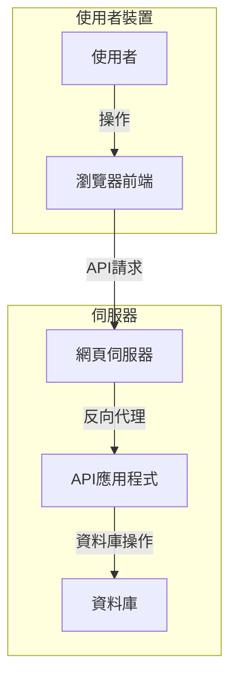

# 軟體架構文件：習慣養成與心情日誌

**版本：1.0**

**作者：Gemini (資深軟體架構師)**

---

本文檔旨在為「習慣養成與心情日誌」專案提供一個清晰、可擴展且高效的高階軟體架構設計。設計的核心思想是確保當前 MVP (最小可行產品) 的快速開發，同時為未來的產品演進預留足夠的彈性。

## 1. 架構總覽 (Architecture Overview)

我們將採用業界成熟的「**前後端分離 (Headless)**」架構。

這意味著我們的系統將由兩個獨立但相互協作的應用程式組成：一個負責使用者介面與互動的「前端應用」，以及一個負責業務邏輯、資料處理與儲存的「後端 API」。

**此架構的主要優點包括：**

*   **技術解耦**：前端和後端可以使用最適合各自場景的技術棧，獨立開發、測試和部署，互不干擾。
*   **專注點分離**：前端工程師可以專注於打造最佳的使用者體驗 (UI/UX)，而後端工程師可以專注於資料庫設計、API 效能與系統安全。
*   **多端支援**：一旦後端 API 開發完成，未來我們可以輕易地為同一個後端開發新的用戶端，例如原生手機 App (iOS/Android) 或桌面應用，而無需重寫任何業務邏輯。
*   **可擴展性**：前後端可以根據各自的負載情況獨立進行擴展。例如，若 API 負載較高，我們可以單獨增加後端伺服器的數量。

### 技術選型 (Technology Stack)

| 元件           | 技術                        | 理由                                                                                              |
| :------------- | :-------------------------- | :------------------------------------------------------------------------------------------------ |
| **後端框架**   | **Python / Flask**          | 輕量、靈活，社群成熟。非常適合快速啟動 API 服務，並能透過其豐富的擴充套件生態逐步成長。           |
| **API 規格**   | **Flask-RESTx**             | 整合 Swagger UI，提供自動化的 API 文件，讓前後端協作更順暢。                                      |
| **資料庫 ORM** | **Flask-SQLAlchemy**        | 將複雜的 SQL 操作抽象化為 Python 物件，簡化資料庫互動，提高開發效率。                             |
| **資料庫**     | **SQLite**                  | 零設定、單一檔案，對新手極其友善，非常適合專案初期與 MVP 階段的快速開發與驗證                     |
| **資料庫遷移** | **Flask-Migrate (Alembic)** | 提供系統化的資料庫結構變更管理，讓團隊協作與部署更加安全。                                        |
| **前端框架**   | **React / Vue.js (建議)**   | 雖然前端獨立，但建議採用主流框架以利用其強大的生態系、元件化開發模式與社群支援。                  |
| **部署**       | **Docker, Gunicorn, Nginx** | 透過 Docker 容器化實現環境一致性，Gunicorn 作為高效的 WSGI 伺服器，Nginx 處理靜態檔案與反向代理。 |

---

## 2. 後端專案結構 (Backend Project Structure)

隨著功能增加，將所有程式碼放在單一的 `app.py` 檔案中會迅速變得難以維護。我們需要一個模組化的結構來組織程式碼，這也是 **Flask Blueprints** 發揮作用的地方。

**Flask Blueprints** 允許我們將應用程式拆分成多個功能獨立的「藍圖」。每個藍圖可以有自己的路由 (routes)、視圖函式 (views) 和模板。例如，我們可以為「使用者認證」、「習慣管理」和「心情記錄」分別建立獨立的藍圖。

**推薦的未來後端資料夾與檔案結構如下：**

```
/eric861129-2025-iThome-HabitTracker
|-- app.py                  # 專案啟動入口 (未來會變得很輕量)
|-- config.py               # 設定檔 (資料庫連線、密鑰等)
|-- requirements.txt        # 專案依賴套件
|-- .gitignore
|-- /instance/
|   |-- database.db              # (開發用) SQLite 資料庫檔案
|-- /app/                   # **核心應用程式資料夾**
|   |-- __init__.py         # 應用程式工廠 (create_app)
|   |-- models.py           # SQLAlchemy 資料庫模型定義
|   |-- /api/               # **所有 API 藍圖的家**
|   |   |-- __init__.py
|   |   |-- auth.py         # 使用者認證 (註冊、登入) 藍圖
|   |   |-- habits.py       # 習慣管理 (新增、查詢、打卡) 藍圖
|   |   |-- moods.py        # 心情管理 (新增、查詢) 藍圖
|   |-- /static/            # 靜態檔案 (CSS, JavaScript)
|   |-- /templates/         # 網頁模板 (如果後端需要渲染頁面)
|-- /migrations/            # Flask-Migrate 自動產生的遷移腳本
|-- /tests/                 # 單元測試與整合測試
```

---

## 3. 互動流程 (Interaction Flow)

以「**使用者新增一個習慣**」為例，一次典型的完整互動流程如下：

1.  **使用者 (User)**：在前端介面 (瀏覽器) 的表單中輸入習慣名稱「每天冥想10分鐘」，然後點擊「儲存」按鈕。
2.  **前端應用 (Frontend App)**：觸發 JavaScript 事件，將表單資料打包成一個 JSON 物件，例如：`{"name": "每天冥想10分鐘", "type": "positive"}`。
3.  **發送 API 請求**：前端透過瀏覽器的 `fetch` 或 `axios`，向後端發送一個 `POST` HTTP 請求。請求的目標是後端定義好的 API 端點 (Endpoint)，例如 `/api/habits`。請求的標頭 (Header) 中會攜帶用於驗證使用者身分的 JWT (JSON Web Token)。
4.  **後端 API (Backend API)**：Flask 應用接收到請求，並將其路由到 `habits` 藍圖中處理 `/api/habits` 路由的函式。
5.  **業務邏輯處理**：
    *   該函式首先驗證請求標頭中的 JWT，確認使用者已登入且身分有效。
    *   接著，它解析請求中的 JSON 資料，並進行驗證 (例如，習慣名稱不能為空)。
    *   驗證通過後，它會使用 `models.py` 中定義的 `Habit` 模型，建立一個新的 Python 物件。
6.  **資料庫操作 (Database)**：後端透過 SQLAlchemy ORM，將這個新的 `Habit` 物件轉換為一條 SQL `INSERT` 語句，並在資料庫中新增一筆紀錄。
7.  **返回 API 回應**：資料庫成功儲存後，後端會向前端返回一個 JSON 格式的回應，狀態碼為 `201 Created`，並附上剛剛建立的習慣資料，例如 `{"id": 123, "name": "每天冥想10分鐘", ...}`。
8.  **更新 UI**：前端接收到成功的回應後，使用回傳的資料來更新畫面，將新的習慣動態地加入到使用者的習慣清單中，無需重新整理整個頁面。

---

## 4. 高階架構圖 (High-Level Architecture Diagram)


