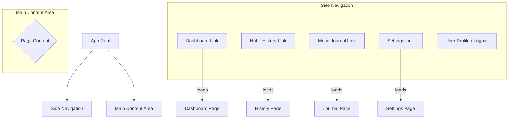

# 佈局與元件拆分 (Layout & Components)

**Document Version: v1.0.0**

---

## 1. 主要應用程式佈局 (Main App Layout)

為了提供清晰、一致的導航體驗，我們將採用一個經典的兩欄式佈局。這種佈局在儀表板類型的應用程式中非常常見，能讓使用者在不同功能區之間輕鬆切換，同時保持上下文的清晰。

*   **側邊導覽列 (Side Navigation)**: 左側是一個固定寬度的垂直導覽列。它將包含所有主要頁面的連結（如儀表板、習慣回顧、心情日誌、設定），以及使用者頭像和登出按鈕。當前所在的頁面連結會有一個明顯的活動狀態，以利於定位。
*   **主內容顯示區 (Main Content Area)**: 右側是佔據剩餘空間的主要內容區域。這個區域的內容會根據使用者在導覽列中的選擇而動態更新，展示對應的頁面。

### Mermaid.js 佈局圖

---

## 2. 可複用元件清單 (Reusable Component Breakdown)

基於推斷的使用者故事與原子設計原則，我們將 UI 拆解為以下可複用的元件。這份清單將作為前端開發的基礎藍圖。

| 元件名稱 (Component Name) | 功能描述 (Description)                                                       | 關鍵元素/所需資料 (Key Elements / Props)                                                     |
| :------------------------ | :--------------------------------------------------------------------------- | :------------------------------------------------------------------------------------------- |
| **Button**                | 應用程式中的主要互動按鈕，支援不同狀態與樣式。                               | `variant` (primary/secondary), `onClick`, `disabled`, `isLoading`, `icon`, `children` (文字) |
| **Input**                 | 用於表單的標準文字輸入框，包含標籤與錯誤提示。                               | `label`, `type` (text/password/email), `value`, `onChange`, `placeholder`, `errorMessage`    |
| **Icon**                  | 標準化的圖示元件，確保全站圖示風格一致。                                     | `name` (e.g., 'check-circle'), `size`, `color`                                               |
| **Card**                  | 一個帶有標準邊框、陰影和內距的容器，用於包裹內容區塊。                       | `children`                                                                                   |
| **HabitListItem**         | 在列表中顯示單一習慣的項目，包含習慣名稱、完成按鈕和編輯選項。               | `habit` (object: {id, name, type}), `onComplete`, `onEdit`                                   |
| **HabitList**             | `HabitListItem` 的容器，負責渲染習慣列表。                                   | `habits` (array of habit objects), `onHabitComplete`, `onHabitEdit`                          |
| **NewHabitForm**          | 用於新增或編輯習慣的表單，由多個 `Input` 和 `Button` 組成。                  | `onSubmit`, `initialData` (for editing)                                                      |
| **CalendarView**          | 以月曆形式展示習慣完成記錄或心情日誌。                                       | `events` (array: {date, status, color}), `onDateClick`                                       |
| **MoodSelector**          | 一組（例如 5 個）可點擊的圖示或表情，讓使用者選擇當前的心情等級。            | `currentMood`, `onSelect`                                                                    |
| **PageHeader**            | 每個頁面頂部的標題區塊，包含頁面標題和一個可選的操作按鈕（如「新增習慣」）。 | `title`, `actionButton` (React node)                                                         |
| **SideNav**               | 完整的側邊導覽列，包含所有導航連結和使用者資訊。                             | `activeRoute`, `user` (object: {name, avatarUrl}), `onLogout`                                |
| **Modal**                 | 一個覆蓋在頁面之上的對話框，用於確認操作（如刪除）或顯示表單。               | `isOpen`, `onClose`, `title`, `children`                                                     |
