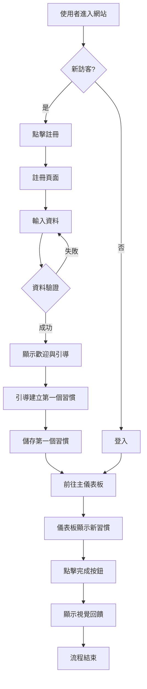

# 使用者故事與流程

**版本：1.0**

**作者：Gemini (產品經理)**

---

## 1. 核心使用者故事與驗收標準 (Core User Stories & Acceptance Criteria)

以下是根據專案章程定義的 5 個最核心的使用者故事，旨在為 MVP (Minimum Viable Product) 提供清晰的開發方向。

---

### **故事 1：建立新習慣**

*   **身為** 一位追求自我成長的使用者，
*   **我想要** 能夠輕鬆地定義我想養成（或戒除）的特定習慣，
*   **以便** 我可以開始客製化我的個人追蹤清單。

**驗收標準 (Acceptance Criteria):**

1.  **Given** 我在主畫面上點擊「新增習慣」按鈕，**When** 我輸入習慣名稱（例如：「每天閱讀 20 分鐘」）並儲存，**Then** 這個新習慣應立即出現在我今天的待辦習慣清單中。
2.  **Given** 我正在建立一個新習慣，**When** 我可以選擇該習慣的類型（例如：「正面習慣」或「負面習慣」），**Then** 系統應根據此分類，在未來的數據分析中進行對應的處理。
3.  **Given** 我嘗試輸入一個已經存在的習慣名稱，**When** 我點擊儲存，**Then** 系統應提示「此習慣已存在」，並防止我建立重複的項目。

---

### **故事 2：每日習慣打卡**

*   **身為** 一位正在養成習慣的使用者，
*   **我想要** 每天都能快速地標記我已完成的習慣，
*   **以便** 我能準確地記錄我的日常進展與努力。

**驗收標準 (Acceptance Criteria):**

1.  **Given** 我的儀表板上顯示了今天的習慣清單，**When** 我點擊某個習慣旁邊的「完成」核取方塊，**Then** 該項目應被清楚地標示為「已完成」（例如：劃掉、變色），並記錄下今天的日期。
2.  **Given** 我不小心錯誤地標記了一個習慣，**When** 我再次點擊同一個核取方塊，**Then** 該習慣的狀態應恢復為「未完成」。
3.  **Given** 我完成了一項習慣的打卡，**When** 系統儲存這筆紀錄，**Then** 這筆紀錄必須與今天日期和我的使用者 ID 綁定。

---

### **故事 3：記錄每日心情**

*   **身為** 一位關心內心狀態的使用者，
*   **我想要** 每天都能簡單地記錄我當下的心情，
*   **以便** 未來能分析我的情緒與特定習慣之間的關聯。

**驗收標準 (Acceptance Criteria):**

1.  **Given** 我在應用程式的指定區域（如儀表板頂部），**When** 我從一個預設的選項中（例如：五個表情符號，從非常開心到非常難過）選擇一個來代表我的心情，**Then** 系統應儲存我今天的選擇。
2.  **Given** 我今天已經記錄過心情，**When** 我再次選擇一個新的心情，**Then** 系統應更新今天的心情紀錄，而不是新增一筆。
3.  **Given** 我尚未記錄今天的心情，**When** 我登入系統，**Then** 介面上應有明顯的提示或視覺引導，鼓勵我完成心情記錄。

---

### **故事 4：檢視習慣與心情的關聯**

*   **身為** 一位希望洞察自我的使用者，
*   **我想要** 在一個簡單的視圖中同時看到我的習慣完成情況與每日心情，
*   **以便** 我能直觀地發現它們之間的潛在模式或關聯。

**驗收標準 (Acceptance Criteria):**

1.  **Given** 我進入「數據回顧」頁面，**When** 我看到一個日曆或時間軸視圖，**Then** 每一天都應同時顯示當天完成的習慣（例如：用圖示表示）和當天記錄的心情（例如：用對應的表情符號）。
2.  **Given** 我在回顧視圖中，**When** 我將滑鼠懸停在某一天上，**Then** 應彈出一個小視窗或提示，顯示當天所有已完成習慣的詳細列表。
3.  **Given** 數據被呈現時，**When** 我查看視圖，**Then** 正面習慣、負面習慣和心情之間應有清晰的視覺區分（例如：使用不同顏色或圖示）。

---

### **故事 5：註冊與登入**

*   **身為** 一位新使用者，
*   **我想要** 一個快速且安全的註冊與登入流程，
*   **以便** 我可以保護我的個人數據，並在不同裝置上同步我的進度。

**驗收標準 (Acceptance Criteria):**

1.  **Given** 我是一個未註冊的使用者，**When** 我在首頁提供有效的電子郵件和密碼並點擊「註冊」，**Then** 我會被自動登入，並導向到一個歡迎或設定引導頁面。
2.  **Given** 我輸入一個已被註冊的電子郵件，**When** 我嘗試註冊，**Then** 系統會顯示一條錯誤訊息，提示「此電子郵件已被使用」。
3.  **Given** 我是一個已註冊的使用者，**When** 我在登入頁面輸入正確的帳號密碼，**Then** 我會被成功登入，並看到我個人的儀表板，其中包含我之前儲存的習慣和紀錄。

## 2. 新使用者首次打卡流程圖 (New User's First Check-in Flow)

### 流程圖詳細說明 (Detailed Flow Description)

1.  **探索與註冊 (Exploration & Sign-up)**
    *   **流程**: `A -> B -> C -> E -> F -> G`
    *   **設計考量**: 此階段的目標是盡可能降低新使用者的進入門檻。我們假設使用者是帶著明確的「改變」意圖而來，因此註冊流程必須快速、無干擾。我們只要求最必要的資訊（Email/密碼），並提供清晰的錯誤提示，確保使用者能順利完成註冊，而不是在中途因挫折而放棄。

2.  **引導與首次價值體驗 (Onboarding & First Value Experience)**
    *   **流程**: `G -> H -> I -> J`
    *   **設計考量**: 註冊成功後，不能將使用者丟在一個空白的儀表板前。一個好的 onboarding 流程會立即引導使用者完成最有意義的第一個動作——**建立他們想要追蹤的習慣**。這不僅能教育使用者如何操作，更重要的是，讓他們立即對這個 App 產生「個人化」的連結。這是將訪客轉化為活躍使用者的關鍵一步。

3.  **核心迴圈的啟動 (Initiating the Core Loop)**
    *   **流程**: `J -> K -> L -> M`
    *   **設計考量**: 當使用者回到儀表板，他們看到的不再是空無一物的介面，而是他們親手建立的目標。這個設計旨在創造一個「立即行動」的機會。將剛建立的習慣清晰地展示出來，並讓「打卡」這個核心動作變得極度簡單直觀（一次點擊），是為了讓使用者能毫不費力地完成第一次正向互動。

4.  **正向回饋與強化 (Positive Feedback & Reinforcement)**
    *   **流程**: `M -> N -> O`
    *   **設計考量**: 使用者完成打卡後，必須給予即時、明確的視覺回饋（例如按鈕變色、出現打勾圖示）。這個小小的滿足感是行為心理學中的「獎勵」，能有效強化使用者繼續使用產品的動機。完成這個流程後，使用者不僅學會了 App 的核心功能，更重要的是，他們已經在「自我改進」的旅程上踏出了第一步，從而更有可能在第二天回來繼續使用。